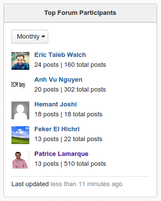
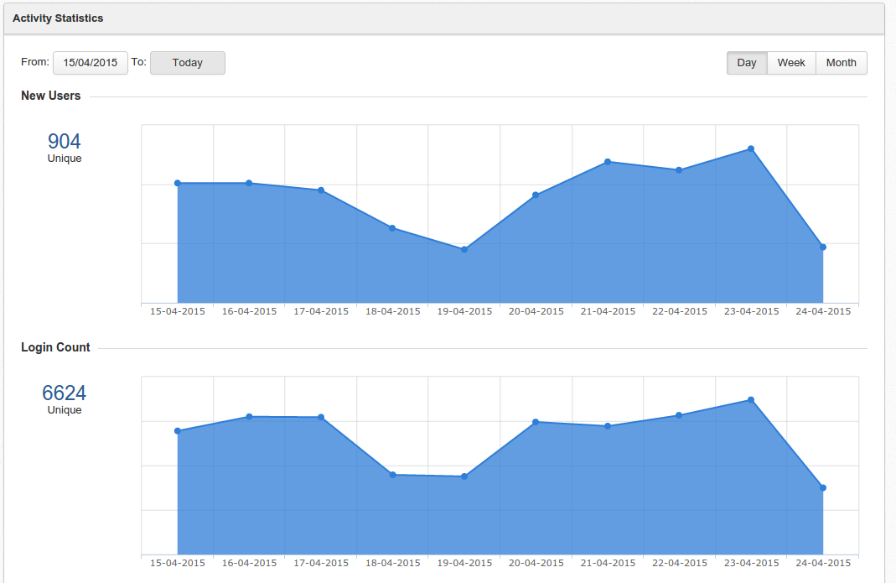
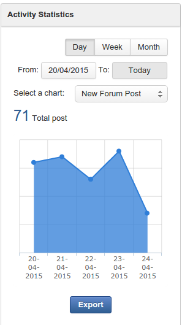

eXo platform Pulse
=====================

Introduce
---------------
"exoplatform-pulse" that contains Activity Statistics Gadgets:
* Top Forum Participant gadget: Show Top Users of Forum Participant
* Activity Statistics gadget: Display eXo Platform statisic. They are: New Users, Login Count, Forum Active Users, New Forum Post, New users social connections, New posts on the activities stream, Total Platform Download.

Compatibility:
---------------
From eXo Platform 4.1

ScreenShot
---------------
* Top Forum Participant: 

 
* Activity Statistics (Maximum view): 

 
* Activity Statistics (Minimum view): 

 
* Activity Statistics (Export data view):

 

Build
---------------
Simply build it with :

	mvn clean install

Deploy to eXo
---------------
After build with this add-on:
* unzip exoplatform-pulse/bundle/target/exoplatform-pulse-bundle-1.0.x-SNAPSHOT.zip
* copy exoplatform-pulse/bundle/target/exoplatform-pulse-bundle-1.0.x-SNAPSHOT.zip/exoplatform-pulse-webapp.war to $Platform-Tomcat/webapps/
copy exoplatform-pulse/bundle/target/exoplatform-pulse-bundle-1.0.x-SNAPSHOT.zip/exoplatform-pulse-lib-1.0.x-SNAPSHOT.jar and exoplatform-pulse/bundle/target/exoplatform-pulse-bundle-1.0.x-SNAPSHOT.zip/exoplatform-pulse-config-1.0.x-SNAPSHOT.jar to $Platform-Tomcat/lib/
* Start tomcat. Done.

Deploy via addon-manager
---------------
run command ./addon install exo-pulse:1.0.x-SNAPSHOT 
